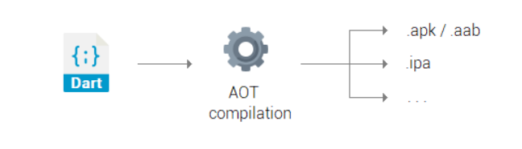
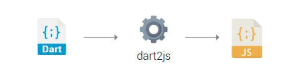
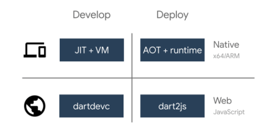

## **INTRODUCTION TO DART**

Dart is a client-optimized, garbage-collected, OOP programming language for creating fast apps that run on any platform.

Dart is a very flexible language. Once source code has been written it can be depolyed in many different ways.

**Stand-alone**: A stand-alone Dart program can't be run without the Dart Virtual Machine (DVM). You need to download and install DVM to execute and run dart program on command-line. The SDK, Other than the compiler and the libraries also offer series or other tools: 
- The **pub** package manager,
- **dart2js** which compiles dart code to deployable JavaScript
- **dartdoc** the Dart documentation generator,
- **dartfmt**, a code formatter.

Stand-alone dart program that can only run if DVM installed machine. To develop Flutter apps for any platform, instead of installing the pure Dart SDK, you need to install flutter. (which is basically the Dart SDK combined with flutter tools).

**AOT compiled**: The Ahead Of Time compilation translating a high-level programming language, like dart, into machine code. AOT is really what makes Flutter fast and portable. With AOT there is no need to have the DVM installed. because at the end you get single binary file (apk or aap for android, ipa for ios, exe for windows...) that can be executed. Flutter SDK combile your dart code into a native binary for mobile, web and desktop. 

AOT compilation is very powerful because it natively brings Dart to mobile desktop. You’ll
end up having a single native binary which doesn’t require a DVM to be installed on the
client in order to run the application.

**Web**: Thanks to the dart2js tool, your Dart project can be "transpiled" into fast and
compact JavaScript code. By consequence Flutter can be run, for example, on Firefox or
Chrome and the UI will be identical to the other platforms

AngularDart 
is a performant web app framework used by Google to build some famous
websites, such as "AdSense" and "AdWords". Of course it’s powered by Dart!

So far we’ve covered what you can do with Dart when it comes to deployment and productionready software. When you have to debug and develop, both for desktop/mobile and web, there
are useful some tools coming to the rescue.

This picture sums up very well how the Dart code can be used in development and deployment. We’ve just covered the "Deploy" side in the above part, so let’s analyze the "Develop"
column:

- **Desktop/mobile**. The Just In Time (JIT) technique can be seen as a "real time translation" because the compilation happens while the program is executing. It’s a sort of
"dynamic compilation" which happens while the program is being used.

JIT compilation, combined with the DVM (JIT + VM in the picture), allows the dispatch
of the code dynamically without considering the user’s machine architecture. In this way
it’s possible to smoothly run and debug the code everywhere without having to mess up
with the underlying architecture.

- **Web**. The Dart development compiler, abbreviated with dartdevc, allows you to run and
debug Dart web apps on Google Chrome. Note that dartdevc is for development only: for
deployment, you should use dart2js. Using special tools like webdev 6
there’s the possibility
to edit Dart files, refreshing Chrome and visualizing changes almost immediately

As you’ve just seen, Dart can run literally everywhere: desktop, mobile and web.

### **PACKAGE SYSTEM**
Dart’s core API offers different packages, such as dart:io or dart:collection, that expose
classes and methods for many purposes. In addition, there is an official online repository called
pub containing packages created by the Dart team, the Flutter team or community users like
you.

If you head to [**pub.dev**](https://pub.dev)  you will find an endless number of packages for any purpose: I/O
handling, XML serialization/de-serialization, localization, SQL/NoSQL database utilities and
much more